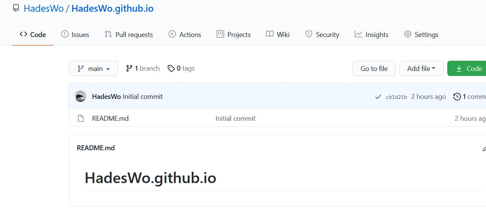
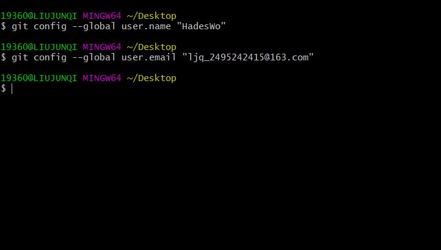
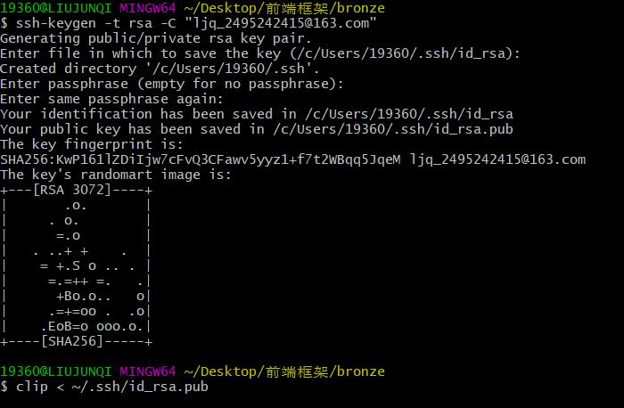
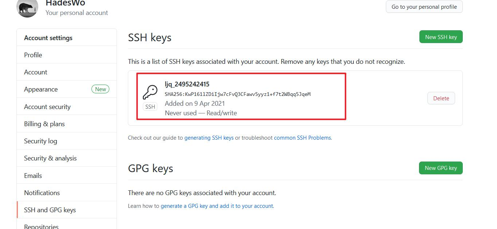
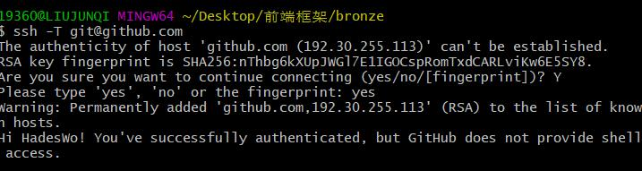
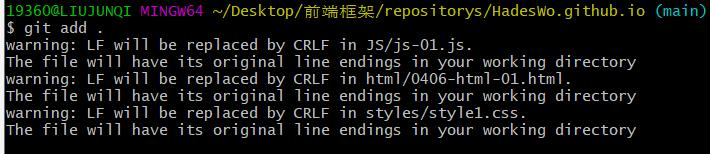
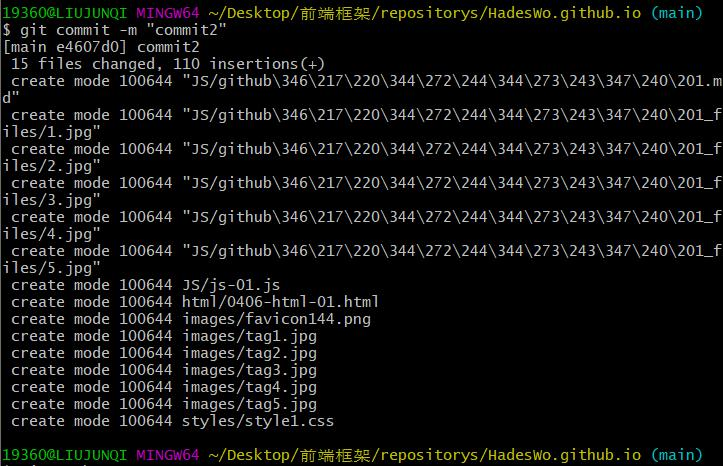
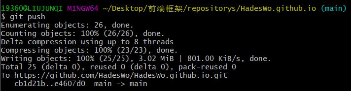
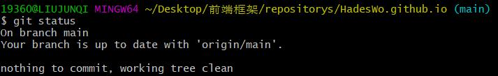

# 使用git提交代码至GitHub
### 1. GitHub上新建仓库

### 2.本地安装完git客户端后进行配置初始化：

### 3. 为Github账户设置SSH key

### 4. 在GitHub上设置

### 5. 测试连接成功

### 6. 提交代码
1. 添加到本地仓库

2. 提交到本地仓库

3. 推代码到远程仓库

4. 查看仓库状态

### 7. 查看远程是否提交成功

